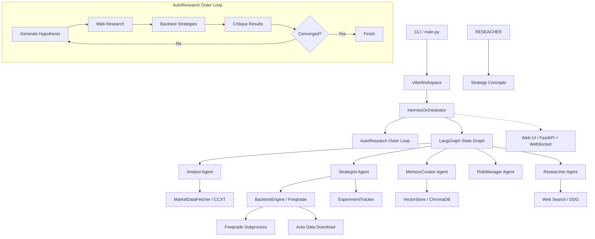
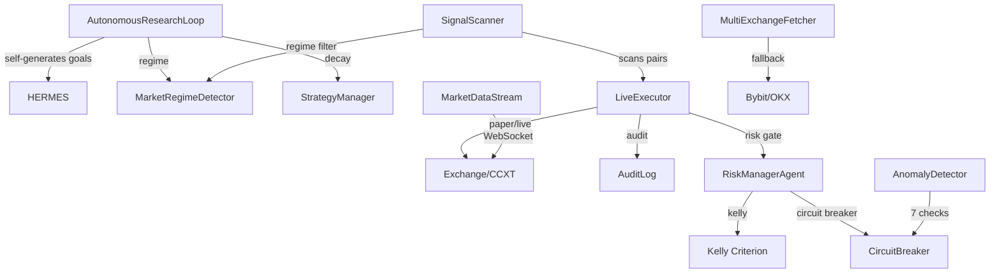

# crypto_agent_bot

Modular crypto trading bot with 5 LangGraph ReAct agents, Freqtrade backtesting, ChromaDB strategy memory, and a real-time Web UI.

**Latest updates (June 2026 — v8: Anti-Overfitting & Data Integrity):**

### Core Infrastructure
- **DeepSeek Chat API** — migrated from OpenRouter to direct DeepSeek API (`api.deepseek.com/v1`, model `deepseek-chat`)
- **Live token usage** — real-time token counter in Web UI showing prompt/completion/total per run
- **EventBus WebSocket streaming** — `monkey_patch_hermes` for auto-research mode, real-time agent activity pushed to UI
- **Auto data download** — checks BTC/USDT 1h data ≥500KB on startup, auto-downloads latest 2 years if missing

### Anti-Overfitting System
- **Hard data holdout** (`backtesting/data_split.py`) — frozen `DataSplitConfig` singleton defines research window (2017–2023) and holdout (2024–2026). All backtests raise `ValueError` on holdout overlap. Walk-forward validation stays strictly within research bounds.
- **Blind parameter search** (`backtesting/blind_search.py`) — 5-phase protocol: LLM defines search space blind → batch backtest → aggregate stats only → directional guidance → quantitative selection. No individual variant results leak to the LLM.
- **Out-of-sample validation** (`backtesting/oos_validator.py`) — `OOSValidator` runs on holdout data only. Results written to `oos_results.jsonl`, never to ChromaDB. Four thresholds: Sharpe≥0.8, WR≥0.42, DD≤0.15, trades≥10.
- **Synthetic data sanity** (`backtesting/synthetic_validator.py`) — random walk checker (max Sharpe 0.3 on noise) + Monte Carlo permutation test (p<0.05 for statistical significance).
- **Conservative Kelly sizing** (`agents/risk_manager.py`) — `PositionSizingTier` enum (VALIDATION 2% → CAUTIOUS 5% → NORMAL 10%). `kelly_position_size_conservative()` applies `BACKTEST_OPTIMISM_FACTOR=0.55` haircut and OOS degradation penalty.
- **Validation mode** (`execution/validation_mode.py`) — 90-day conservative execution: 2% position cap, tight circuit breakers (-1.5% daily / -4% weekly), separate audit log. Requires Sharp≥0.6 + 50 trades for graduation.
- **11-gate deployment pipeline** (`orchestration/deployment_pipeline.py`) — 9 automated gates + 2 manual OOS gates. Tracks strategy state from `explored` → `promising` → `validated` → `pending_oos` → `deployable`.
- **Performance monitoring** (`monitoring/performance_monitor.py`) — statistical significance testing (≥30 trades required), expected degradation ranges, regime mismatch detection with 3-day suspension threshold.
- **ChromaDB contamination guard** (`memory/vector_store.py`, `agents/curator.py`) — strategies tagged with `discovered_on_window` metadata. Cross-window exclusion queries prevent data leakage between research cycles.

### Smart Backtesting
- **Metrics parsing** — handles multiple Freqtrade output schemas with multi-field-name fallback; debug JSON dump on each run
- **Hyperopt support** — 6 strategy types have `IntParameter` declarations (`sma_crossover`, `combined_sma_rsi`, `macd_crossover`, `rsi_oversold`, `bollinger_bands`, `multi_timeframe`); `--spaces buy sell roi stoploss` flag
- **Walk-forward validation** — splits timerange into N windows, auto-detects data range, enforces 14-day minimum window
- **ExperimentTracker** (`orchestration/experiment_tracker.py`) — JSONL-backed experiment store with composite scoring (`Sharpe×0.5 + WR×0.3 + (1-DD×10)×0.2`); `suggest_next_params()` with type safety and valid range clamping
- **Type coercion guard** — every generated strategy's `populate_indicators()` auto-coerces string columns to numeric to prevent Arrow backend crashes

### Autonomous Research
- **`--auto-research`** mode — runs the full pipeline autonomously: regime detection → sentiment → web search → backtest → iterate → converge
- **Auto-research from Web UI** — submit goals starting with `Auto-research:` through the UI modal
- **Realistic convergence targets** — Sharpe ≥ 0.8, WR ≥ 40%, DD ≤ 15%, trades ≥ 5
- **Strategy concept library** (`data/strategy_concepts.py`) — 10 structured concepts with regime mapping, injected into LLM system prompt

### Researchers & Agents
- **Concept-aware strategy specs** — `generate_custom_strategy_spec` auto-maps concepts to strategy types using keyword matching
- **Strategy-relevant web search** — post-processes DuckDuckGo results, scores by trading keyword relevance
- **Strategy memory** — ChromaDB stores backtest results (type, params, metrics, regime); past winners inform future LLM runs

### Web UI
- **6 metric cards** — Sharpe, Win Rate, Drawdown, Trades, Market Sentiment, **Token Usage** (live-updating)
- **Agent timeline** — real-time agent activity feed
- **Hypothesis display** — iteration counter with critique overlay
- **SVG Sharpe chart** — no external charting dependencies
- **Auto-scrolling event log** — WebSocket event stream with heartbeats

### Data Sources
- **Market data**: CCXT (Binance), OHLCV via `fetch_ohlcv()`
- **Sentiment**: Fear & Greed Index (alternative.me), CoinGecko news (requires `COINGECKO_API_KEY`), CryptoPanic (requires `CRYPTOPANIC_API_KEY`)
- **Patterns**: 13 TA-Lib candlestick patterns (hammer, engulfing, morning star, etc.)
- **Regime**: ADX/ATR/SMA200 classification → strong_uptrend/downtrend, ranging, volatile, weak_trend
- **On-chain**: Whale Alert (requires `WHALE_ALERT_API_KEY`), CoinGecko volume proxy — gated by `ENABLE_ONCHAIN` flag

## Architecture



## Components

| Component | File | Role |
|---|---|---|
| **MarketDataFetcher** | `data/fetcher.py` | Live OHLCV + price via CCXT |
| **BacktestEngine** | `backtesting/engine.py` | Strategy backtesting via Freqtrade, 11 strategy types + hyperopt + walk-forward |
| **AutoSetupData** | `backtesting/setup_data.py` | Auto-downloads historical data on startup |
| **VectorStore** | `memory/vector_store.py` | ChromaDB vector store with strategy memory (Sharpe-filtered, regime-aware) |
| **OnChainFetcher** | `data/onchain.py` | Whale Alert + CoinGecko volume proxy (gated) |
| **StrategyConcepts** | `data/strategy_concepts.py` | 10 structured concepts with regime mappings |
| **AnalystAgent** | `agents/analyst.py` | Market analysis with live data tools |
| **StrategistAgent** | `agents/strategist.py` | 13 tools: strategy gen, backtest, hyperopt, walk-forward, memory-aware |
| **ResearcherAgent** | `agents/researcher.py` | Web search, paper reading, concept-mapped strategy specs |
| **RiskManagerAgent** | `agents/risk_manager.py` | Risk metrics + go/no-go verdict |
| **MemoryCuratorAgent** | `agents/curator.py` | Cross-session memory retrieval from ChromaDB |
| **HermesOrchestrator** | `orchestration/hermes.py` | Multi-agent LangGraph orchestration + outer research loop |
| **LangGraph Graph** | `orchestration/graph.py` | State-machine orchestration with 4 cycles |
| **AutoResearch** | `orchestration/auto_research.py` | Autonomous pipeline: regime → sentiment → research → backtest → converge |
| **ExperimentTracker** | `orchestration/experiment_tracker.py` | JSONL-backed experiment store with composite scoring |
| **ResearchIteration** | `orchestration/research.py` | Hypothesis/critique dataclass with convergence check |
| **VibeWorkspace** | `workspace/vibe.py` | Rich CLI research workspace |
| **PaperTrader** | `execution/paper_trader.py` | Dry-run live simulation |
| **FastAPI Server** | `api/server.py` | WebSocket streaming + REST endpoints |
| **EventBus** | `api/event_bus.py` | Async event streaming for Web UI |
| **Web UI** | `ui/index.html` | Single-file React dashboard with 6 metric cards |
| **TokenTracker** | `agents/token_tracker.py` | Thread-safe token usage accumulator with live UI counter |
| **SentimentFetcher** | `data/sentiment.py` | Fear & Greed + CoinGecko news (with API key support) |
| **PatternDetector** | `data/patterns.py` | 13 candlestick patterns via TA-Lib |
| **MarketRegimeDetector** | `data/regime.py` | ADX/ATR/SMA200 regime classification |
| **DataSplitConfig** | `backtesting/data_split.py` | Frozen singleton defining research/holdout split |
| **BlindParameterSearch** | `backtesting/blind_search.py` | Blind 5-phase parameter search |
| **OOSValidator** | `backtesting/oos_validator.py` | Holdout-only strategy validation |
| **SyntheticValidator** | `backtesting/synthetic_validator.py` | Random walk + permutation sanity checks |
| **DeploymentPipeline** | `orchestration/deployment_pipeline.py` | 11-gate strategy deployment gauntlet |
| **ValidationMode** | `execution/validation_mode.py` | 90-day conservative execution with tight CB |
| **PerformanceMonitor** | `monitoring/performance_monitor.py` | Live vs backtest degradation tracking |

## Setup

```bash
# 1. Create virtual environment
python -m venv venv

# 2. Activate it
source venv/Scripts/activate   # Git Bash
venv\Scripts\activate          # Windows CMD

# 3. Install dependencies
pip install -r requirements.txt

# 4. Configure
cp .env.example .env
# Edit .env with your LLM API key (DeepSeek or OpenAI-compatible)
# The system uses DEEPSEEK by default: api.deepseek.com/v1, model deepseek-chat

# 5. Scaffold Freqtrade user data
python backtesting/setup_ft.py

# 6. Historical data downloads automatically on first run
```

## Usage

```bash
# Web UI dashboard
python main.py --ui

# Web UI with demo goal auto-started
python main.py --demo

# Autonomous research mode (CLI)
python main.py --auto-research "BTC momentum strategies 2026"

# Interactive workspace
python main.py run

# One-shot research goal
python main.py new-goal "Find optimal SMA crossover for BTC/USDT"
```

## v7 — Autonomous Trading System

> **Upgraded June 2026**: AutonomousResearchLoop + LiveExecutor + SignalScanner + full risk management

### New Architecture



### New CLI Commands

```bash
# Fully autonomous mode (self-directing, no human goals needed)
python main.py --autonomous

# Autonomous mode with web UI dashboard
python main.py --autonomous --ui

# Legacy modes still work
python main.py --ui
python main.py --auto-research "BTC momentum strategies"
```

### Key New Components

| Component | File | Role |
|-----------|------|------|
| **AutonomousResearchLoop** | `orchestration/autonomous_loop.py` | Self-directing research engine |
| **RegimeSnapshot** | `data/regime.py` | Rich regime classification with confidence + strategy map |
| **RiskManagerAgent** | `agents/risk_manager.py` | Kelly sizing, correlation gate, circuit breaker, pre-trade approval |
| **CircuitBreaker** | `agents/risk_manager.py` | Global halt switch — stops all trading on critical conditions |
| **LiveExecutor** | `execution/live_executor.py` | Bridges approved strategies to exchange orders |
| **TradeSignal** | `execution/trade_signal.py` | Structured trade proposal with full provenance |
| **AuditLog** | `execution/audit_log.py` | Append-only JSONL log of every trade decision |
| **SignalScanner** | `execution/signal_scanner.py` | Scans all pairs × approved strategies every 60s |
| **MarketDataStream** | `data/stream.py` | Live Binance WebSocket feeds |
| **AnomalyDetector** | `monitoring/anomaly_detector.py` | 7 anomaly checks: rapid drawdown, stuck positions, API errors |
| **StrategyManager** | `orchestration/strategy_manager.py` | Strategy decay detection + auto-retire |
| **MultiExchangeFetcher** | `data/fetcher.py` | Best-price routing + Binance/Bybit fallback |
| **ResearchGoal** | `orchestration/research.py` | Structured goal dataclass |

### Safety Features

| Feature | Description | Threshold |
|---------|-------------|-----------|
| **Kelly Sizing** | Fractional Kelly (25% default) caps position size | Max 10% of portfolio per trade |
| **Correlation Gate** | Rejects over-concentrated positions | Max correlation 0.7 |
| **Circuit Breaker** | Halts all trading on critical conditions | Daily -3%, Weekly -8% |
| **Rapid Drawdown** | >2% in <10 minutes triggers halt | Automatic |
| **Signal Flood** | >10 signals in 60 seconds (likely bug) | Auto-halt |
| **Strategy Decay** | Auto-retires strategies with score < 0.5 | Live/backtest ratio |
| **Paper Mode** | Always starts in paper mode | `EXECUTION_MODE=paper` |

### New .env Variables

```ini
AUTONOMOUS_INTERVAL_MINUTES=30
DECAY_THRESHOLD=0.20
COVERAGE_GAP_SHARPE=0.80
MAX_DAYS_WITHOUT_REGIME_RESEARCH=7
EXECUTION_MODE=paper
LIVE_MAX_POSITION_USDT=100
TWAP_THRESHOLD_USDT=500
STOP_LOSS_DEFAULT=0.04
TAKE_PROFIT_DEFAULT=0.08
EXCHANGES=binance,bybit
FUTURES_ENABLED=false
```

### Auto-Research from Web UI
Submit a goal in the modal starting with `Auto-research:`:
```
Auto-research: BTC momentum with volume confirmation and ADX filter
```

The system will run the full pipeline autonomously — regime detection, sentiment analysis, web research, strategy generation, backtesting, and iteration until convergence.

## Web UI

```bash
python main.py --ui
```

Opens at `http://127.0.0.1:8765`. Features:
- **6 metric cards**: Sharpe Ratio, Win Rate, Max Drawdown, Total Trades, Market Sentiment, **Token Usage** (live)
- **Agent timeline**: real-time activity feed showing which agent is running
- **Hypothesis display**: current hypothesis with iteration counter
- **SVG Sharpe chart**: iteration history plotted as a line chart
- **Auto-scrolling event log**: complete WebSocket event stream
- **Run New Goal modal**: configure cycles, iterations, and goal text

## Configuration (.env)

| Variable | Default | Description |
|---|---|---|
| `OPENAI_API_KEY` | — | LLM API key (DeepSeek or OpenAI-compatible) |
| `OPENAI_BASE_URL` | `https://api.deepseek.com/v1` | API base URL |
| `LLM_MODEL` | `deepseek-chat` | Model name |
| `EXCHANGE_ID` | `binance` | CCXT exchange |
| `SYMBOL` | `BTC/USDT` | Trading pair |
| `TIMEFRAME` | `1h` | Candle interval |
| `CHROMA_DB_PATH` | `./chroma_db` | Vector store directory |
| `ENABLE_SENTIMENT` | `true` | Enable Fear & Greed / news sentiment |
| `ENABLE_PATTERNS` | `true` | Enable candlestick pattern detection |
| `ENABLE_ONCHAIN` | `false` | Enable on-chain data (requires Whale Alert key) |
| `CRYPTOPANIC_API_KEY` | — | Optional CryptoPanic news key |
| `COINGECKO_API_KEY` | — | Optional CoinGecko Pro API key (for news) |
| `HF_TOKEN` | — | Optional HuggingFace token (suppresses model download warning) |
| `WHALE_ALERT_API_KEY` | — | Optional Whale Alert key |

## Strategy Types

The strategist supports 11 strategy types:

| Type | Description | Indicators |
|---|---|---|
| `sma_crossover` | SMA fast/slow crossover | `ta.SMA` |
| `macd_crossover` | MACD signal line / histogram crossover | `ta.MACD` (parameterized) |
| `rsi_oversold` | RSI oversold/overbought | `ta.RSI` (parameterized thresholds) |
| `bollinger_bands` | Bollinger Bands lower/upper touch | `ta.BBANDS` (parameterized period) |
| `combined_sma_rsi` | SMA crossover + RSI filter | `ta.SMA`, `ta.RSI` |
| `momentum` | ROC + volume confirmation | `ta.ROC`, `ta.SMA`, `ta.RSI` |
| `breakout` | N-period high breakout with volume spike | rolling max, `ta.SMA`, `ta.ATR` |
| `mean_reversion` | BB + RSI oversold for ranging markets | `ta.BBANDS`, `ta.RSI` |
| `volatility_squeeze` | BB width contraction then MACD expansion | `ta.BBANDS`, `ta.MACD` |
| `sentiment_driven` | RSI + SMA when fear/greed < 30 | `ta.RSI`, `ta.SMA` |
| `multi_timeframe` | SMA20/50 crossover + SMA200 + ADX | `ta.SMA`, `ta.ADX` |

## Strategist Tools (13 total)

`generate_strategy`, `set_backtest_config`, `run_backtest`, `download_data`, `compare_strategies`, `interpret_metrics`, `suggest_next_params`, `get_best_strategy`, `get_iteration_history`, `get_research_history`, `run_hyperopt`, `walk_forward_validate`

## Running Tests

```bash
# Existing tests (v6 + v7)
python -m pytest test_phase2.py test_sentiment.py test_patterns.py test_regime.py -v
python test_experiment_tracker.py
python test_walk_forward.py

# Anti-overfitting tests (87 tests)
python -m pytest test_data_split.py test_blind_search.py test_oos_validator.py -v
python -m pytest test_deployment_pipeline.py test_kelly_conservative.py -v
python -m pytest test_synthetic_validator.py test_validation_mode.py -v
python -m pytest test_performance_monitor.py -v

# All tests
python -m pytest test_data_split.py test_blind_search.py test_oos_validator.py \
  test_deployment_pipeline.py test_kelly_conservative.py \
  test_synthetic_validator.py test_validation_mode.py \
  test_performance_monitor.py \
  test_phase2.py test_sentiment.py test_patterns.py test_regime.py -v
```

## How It Works

1. **Define a research goal** via the CLI or Web UI (or use `Auto-research:` prefix for full autonomous mode)
2. **AutoResearch** runs the outer loop: hypothesis → research → backtest → critique → repeat until convergence
3. **Market context** (sentiment, patterns, regime) is injected before each research cycle
4. **4-cycle LangGraph** processes: analysis → enhanced analysis → strategy generation/backtesting → risk assessment
5. **Strategist** uses ChromaDB strategy memory to learn from past winners; runs hyperopt / walk-forward validation
6. **ExperimentTracker** records every backtest with composite scoring for data-driven parameter suggestions
7. **Results** are stored in ChromaDB, workspace registry, and streamed live to the Web UI via WebSocket
8. **Convergence** is checked against realistic targets (Sharpe ≥ 0.8, WR ≥ 40%, DD ≤ 15%, trades ≥ 5)
