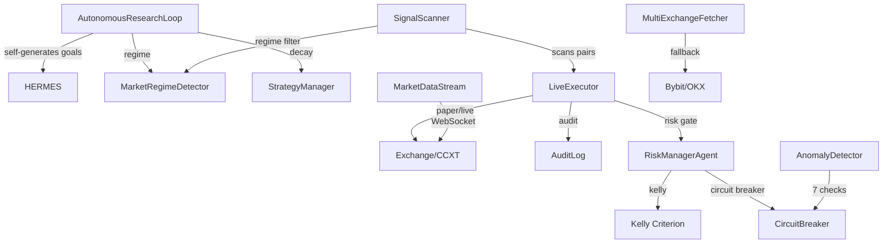

# crypto_agent_bot

Modular crypto trading bot with 7 LangGraph ReAct agents, Freqtrade backtesting, ChromaDB strategy memory, and a real-time Web UI.

**Latest updates (June 2026 — v14.1: Terminal Log Streaming + Sharpe History Chart):**

### v14.1 Features — Live Terminal Logs in Dashboard & Sharpe History Chart
- **Terminal Log dashboard panel** (`api/event_bus.py`, `ui/index.html`) — New `LoggingEventBusHandler` (logging.Handler subclass) pipes all `logger.info()`/`warning()`/`error()` output into the EventBus as `log` events. Collapsible `TerminalLogPanel` in the Dashboard tab with DM Mono font, color-coded severity badges (INFO=teal, WARNING=gold, ERROR=coral), auto-scroll to bottom, and 500-entry ring buffer. Collapsed by default.
- **Sharpe History Chart** (`ui/index.html`) — New `SharpeHistoryChart` React component in the Dashboard tab plotting best-so-far Sharpe trajectory. Record-setting points are connected with a line and labelled; non-record iterations render as small greyed dots. SVG-based, no external charting deps.
- **`with_token_tracking` decorator** (`api/event_bus.py`) — Replaces `monkey_patch_hermes` with a functional wrapper that emits `token_usage` events after key lifecycle events (`hypothesis`, `critique`, `iteration_result`). Thread-safe via `make_callback()`.
- **Top-level imports** (`main.py`, `api/server.py`) — All modules use module-level imports instead of lazy local imports (`asyncio`, `httpx`, `uvicorn`, `signal`, `subprocess`, `webbrowser`, `rich.table`, `rich.console`, `Path`). No functional change — faster cold start, better IDE support.
- **Circuit Breaker state module** (`state/circuit_breaker.py`) — New `CircuitBreakerState` class extracted from `RiskManagerAgent` for shared circuit breaker state between orchestration and execution layers. Used by `api/server.py` endpoints.
- **Web UI state persistence** (`ui/index.html`, `orchestration/autonomous_loop.py`) — Iteration results saved to `workspace/iteration_results.json` on each append, restored on startup (survives server restart). Seven WebSocket-fed state vars (hypothesis, iteration, metrics, chart data, timeline, log, tokens) persisted to `localStorage` with 1-hour staleness guard (survives page refresh).
- **Evaluation pipeline** (`orchestration/evaluation.py`) — New module for post-backtest strategy evaluation scoring.
- **Test reorganization** — All test files moved from project root into `tests/test_agents/`, `tests/test_api/`, `tests/test_backtesting/`, `tests/test_data/`, `tests/test_database/`, `tests/test_execution/`, `tests/test_integration/`, `tests/test_monitoring/`, `tests/test_orchestration/`, `tests/test_risk/`, `tests/test_state/`, `tests/test_tools/`. Each directory has `__init__.py`. New tests: `test_graph.py`, `test_hermes.py`, `test_signal_evaluation.py`.
- **Graphify knowledge graph updated** — 3,443 nodes (was 2,617), 6,094 edges (was 4,763), 289 communities (was 207).

### v14 Features — SearXNG Self-Hosted Search & ML Trade Quality
- **SearXNG self-hosted metasearch** (`agents/researcher.py`, `config.py`) — Primary web search via local SearXNG instance (`SEARXNG_URL`), bypasses DuckDuckGo rate limits (HTTP 202 responses). Falls through to Tavily → DuckDuckGo. Config vars: `SEARXNG_URL` (default: `http://localhost:4000`), persistent override file at `searxng_settings.yml`.
- **ML Trade Quality Scorer** (`execution/quality_scorer.py`) — New `TradeQualityScorer` class using `sklearn.ensemble.RandomForestClassifier` to predict trade quality (0-1) from backtest metrics. Cold-start returns 1.0 until 30+ samples collected. Auto-retrains every 25 predictions after a trade result is logged.
- **Quality score → sizing multiplier** — Score >= 0.7: full Kelly (1.0x). Score 0.4–0.7: proportional reduction. Score < 0.4: block trade (0.0x).
- **Quality fields on TradeSignal** (`execution/trade_signal.py`) — Added `quality_score: float = 1.0` and `quality_multiplier: float = 1.0` fields.
- **RiskManager assess_trade_quality tool** (`agents/risk_manager.py`) — New tool in risk assessment pipeline: `update_drawdown → kelly → drawdown_sizing → correlation → circuit_breaker → risk_assessment → assess_trade_quality → pre_trade_approval`.
- **SignalScanner metrics fix** (`execution/signal_scanner.py`) — No longer hardcodes placeholder sharpe=1.0/win_rate=0.5/max_dd=0.05. Pulls real backtest metrics from vector store.
- **Database experiments query** (`data/database.py`) — Added `query_experiments_with_verdict()` for ML training data.
- **Full test suite**: 636+ passed, 0 failures.

### v13 Fixes — WebSocket Streaming & EventBus Reliability
- **Fixed WebSocket `/ws/autonomous` connect-close cycle** (`main.py`) — `_run_ui()` changed from subprocess to in-process `uvicorn.Server` so `app.state.event_bus` is available to the WS handler. Previously the subprocess created a fresh `app` instance where the event bus was never set, causing immediate close on connect.
- **Fixed EventBus coroutine crash** (`api/event_bus.py`) — `patched_run` wrapping `_run_research_goal` changed to `async def` with `await`, so the coroutine is properly awaited when called via `asyncio.run()` in the thread pool.
- **Stale event loop cache removed** (`api/event_bus.py`) — `emit()` now calls `asyncio.get_running_loop()` on each invocation instead of caching a `nonlocal` reference. Prevents silently dropped events when the cached loop is destroyed by `asyncio.run()` completion.
- **Autonomous loop WebSocket endpoint** (`api/server.py`) — New `/ws/autonomous` endpoint streams `heartbeat`, `iteration_start`, `iteration_result` events to the dashboard.
- **UI WebSocket integration** (`ui/index.html`) — React effect connects to `/ws/autonomous` with auto-reconnect, routes events through `processEvent()` for live dashboard updates.
- **Template placeholder guard** (`backtesting/engine.py`) — `_validate_strategy()` detects unsubstituted `$placeholder` tokens from `string.Template`, raising `ValueError` before they reach Freqtrade.

### Core Infrastructure
- **DeepSeek Chat API** — migrated from OpenRouter to direct DeepSeek API (`api.deepseek.com/v1`, model `deepseek-chat`)
- **Live token usage** — real-time token counter in Web UI showing prompt/completion/total per run
- **EventBus WebSocket streaming** — native `event_callback` hook on `HermesOrchestrator` emits real-time agent activity (hypothesis, critique, task_done, iteration_result) to the Web UI
- **Auto data download** — checks BTC/USDT 1h data ≥500KB on startup, auto-downloads latest 2 years if missing

### Anti-Overfitting System (v8, continued)

### Transaction Cost Realism (`backtesting/engine.py`)
- **TransactionCostModel** — dataclass with maker fee (0.1%), taker fee (0.075%), slippage (0.05%) derived from config
- **Fee injection** — `--fee` flag passed to every Freqtrade subprocess call; fee baked into `config.fee`
- **Net-of-costs metrics** — `net_sharpe_ratio` computed in parsed results using cost drag estimation
- **OOSValidator pass criteria** — now uses `net_sharpe` (after cost model), not gross Sharpe. Strategies must clear 0.8 after costs
- **PerformanceMonitor thresholds** — tightened to 20-40% Sharpe degradation (costs already modelled)
- **BACKTEST_OPTIMISM_FACTOR** — no longer hardcoded at 0.55; imported from `config.settings`
- Config vars: `MAKER_FEE`, `TAKER_FEE`, `SLIPPAGE_PCT`, `SLIPPAGE_MODEL`

### Web Search Upgrade (`agents/researcher.py`)
- **Tavily primary search** — when `TAVILY_API_KEY` is set and `TAVILY_ENABLED=true`, uses Tavily API (advanced search depth)
- **DuckDuckGo fallback** — falls back automatically when Tavily is uninstalled, disabled, or errors
- **Result caching** — search results stored in ChromaDB (`search_cache` collection) to avoid redundant API calls
- Config vars: `TAVILY_API_KEY`, `TAVILY_ENABLED`

### SQLite Database (`data/database.py`)
- **TradingDatabase** — SQLite-backed persistent storage replacing JSONL as primary data store
- **5 tables**: `trades`, `experiments`, `oos_results`, `pipeline_results`, `validation_trades` — all with indexed columns
- **WAL mode** — concurrent read/write safe, no corruption on crash
- **Context manager** — `with db.transaction() as conn:` for safe, atomic transactions
- **Migration** — `migrate_jsonl()` reads existing JSONL files and populates SQLite (idempotent)
- **Dual write** — all 5 modules write to both SQLite and JSONL; JSONL writes disabled via `LEGACY_JSONL_BACKUP=false`
- Config var: `LEGACY_JSONL_BACKUP`
- Single file: `workspace/trading.db`
- **Hard data holdout** (`backtesting/data_split.py`) — frozen `DataSplitConfig` singleton defines research window (2017–2023) and holdout (2024–2026). All backtests raise `ValueError` on holdout overlap. Walk-forward validation stays strictly within research bounds.
- **Blind parameter search** (`backtesting/blind_search.py`) — 5-phase protocol: LLM defines search space blind → batch backtest → aggregate stats only → directional guidance → quantitative selection. No individual variant results leak to the LLM.
- **Out-of-sample validation** (`backtesting/oos_validator.py`) — `OOSValidator` runs on holdout data only. Results written to `oos_results.jsonl`, never to ChromaDB. Four thresholds: Sharpe≥0.8, WR≥0.42, DD≤0.15, trades≥10.
- **Synthetic data sanity** (`backtesting/synthetic_validator.py`) — random walk checker (max Sharpe 0.3 on noise) + Monte Carlo permutation test (p<0.05 for statistical significance).
- **Conservative Kelly sizing** (`agents/risk_manager.py`) — `PositionSizingTier` enum (VALIDATION 2% → CAUTIOUS 5% → NORMAL 10%). Bayesian Kelly using Beta(2,2) posterior with 90% CI lower bound as win rate. `kelly_position_size_conservative()` applies degradation haircut + Bayesian CI lower bound.
- **Validation mode** (`execution/validation_mode.py`) — 90-day conservative execution: 2% position cap, tight circuit breakers (-1.5% daily / -4% weekly), separate audit log. Requires Sharp≥0.6 + 50 trades for graduation.
- **11-gate deployment pipeline** (`orchestration/deployment_pipeline.py`) — 9 automated gates + 2 manual OOS gates. Gate 6 replaced with CPCV (combinatorial purged cross-validation). Tracks strategy state from `explored` → `promising` → `validated` → `pending_oos` → `deployable`.
- **Performance monitoring** (`monitoring/performance_monitor.py`) — statistical significance testing (≥30 trades required), expected degradation ranges, regime mismatch detection with 3-day suspension threshold.
- **ChromaDB contamination guard** (`memory/vector_store.py`, `agents/curator.py`) — strategies tagged with `discovered_on_window` metadata. Cross-window exclusion queries prevent data leakage between research cycles.

### Regime-Conditioned Gating (`execution/signal_scanner.py`)
- **RegimeTransitionTracker** — tracks regime changes with timestamps, 30-minute cooldown on transitions
- **Validated regimes** — each strategy lists which regimes it was validated in; gating blocks mismatched signals
- **Confidence gating** — low regime confidence raises signal floor from 0.6 to 0.75

### 5-Level Strategy Decay (`orchestration/strategy_manager.py`)
- HEALTHY (>=0.90), WARNING (>=0.75), DECAYING (>=0.50), CRITICAL (<0.50), RETIRED
- **Auto-recovery** — DECAYING->WARNING after 3+ improvements; CRITICAL->DECAYING on single improvement
- **Critical counter** — auto-retire after 5 consecutive critical evaluations

### Portfolio VaR (`risk/portfolio_var.py`)
- Variance-covariance VaR (95%/99%), historical simulation, marginal VaR per position
- Correlation matrix with high-correlation warnings (>0.7)
- Exposure limits: 50% total portfolio cap, 15% single position cap

### Telegram Alerter (`monitoring/telegram_alerter.py`)
- Inline approve/reject buttons on trade signals with 5-minute timeout
- Critical alerts forwarded from anomaly detector, circuit breaker, strategy retirement
- Event bus subscriber — automatic forwarding of anomaly_detected, circuit_breaker_halt events
- No-op without TELEGRAM_BOT_TOKEN / TELEGRAM_CHAT_ID

### Fast Pre-filter (`backtesting/signal_factory.py`)
- **SignalFactory** — 11 vectorized signal functions mirroring Freqtrade templates (same TA-Lib, same params)
- **FastMetrics** — vectorized Sharpe, win rate, max DD, trade count (<1s per strategy)
- Runs inside BacktestEngine before Freqtrade subprocess — zero agent changes
- Loose thresholds (Sharpe>=0.5, WR>=40%, trades>=3) — noise filter, not quality gate

### External Data API Integrations

Three external data APIs integrated with shared infrastructure (SQLite api_cache, APIHealthTracker):

**CoinCap v3** (`data/coincap_fetcher.py`) — Backup price feed:
- `get_price()`, `get_batch_prices()`, `get_ohlcv_fallback()` — REST API with httpx
- Symbol mapping: `BTC/USDT` → `bitcoin`
- Tertiary fallback in MultiExchangeFetcher (Binance → Bybit → CoinCap)
- Degraded-mode WebSocket backup on 3x reconnect failure (polls CoinCap REST every 10s)
- Rate limit: 10 calls/min free tier. Config vars: `COINCAP_API_KEY`, `COINCAP_ENABLED`, `COINCAP_FALLBACK_ONLY`

**Santiment** (`data/santiment_fetcher.py`) — Social volume + developer activity:
- Direct GraphQL via httpx (no sanpy dependency). Queries: `social_volume_total`, `sentiment_balance_total`, `dev_activity`, `social_dominance_total`, `daily_active_addresses`
- `SantimentSignal` dataclass with all 5 metrics
- `get_trending_assets()` fetches assets with surging social volume (boosted priority in AutonomousResearchLoop)
- `get_batch_signals()` fetches multiple assets concurrently via `asyncio.gather`
- Free tier: data lags ~30 days, query dates auto-capped. 30 min SQLite cache TTL
- Integrated into `CombinedSentiment` (25% weight) + `RegimeSnapshot` (social dominance z-score)
- Config vars: `SANTIMENT_API_KEY`, `SANTIMENT_ENABLED`, `SANTIMENT_CACHE_TTL`, `SANTIMENT_SLUGS`

**CoinGecko** (`agents/researcher.py` get_asset_fundamentals) — Asset fundamentals:
- Replaces dead Messari API. Uses CoinGecko free API (`GET /api/v3/coins/{id}` via urllib, no external deps)
- Returns: price, market cap, 24h volume, 24h/7d change, GitHub stars/forks/4wk commits, Reddit subscribers
- No API key required (free tier, 10-30 calls/min). Slugs: "bitcoin", "ethereum", "solana"

**Messari** (`data/messari_fetcher.py`) — DEPRECATED (public API shut down after Galaxy Digital acquisition). Fetcher returns None gracefully. MESSARI_ENABLED=false by default.

**Shared Infrastructure:**
- **SQLite api_cache** (`data/database.py`) — `api_cache` table with TTL-based expiry, `get_cached()`/`set_cached()` methods
- **APIHealthTracker** (`data/api_health.py`) — Tracks consecutive failures per source, provides `/api/data/health` endpoint. `is_healthy` property when <3 consecutive failures
- **RateLimiter** (`data/rate_limiter.py`) — Token bucket with thread-safe lock, automatic refill. 20 req/min default
- MongoDB is not used — StateBroker in-memory default sufficient for single-process mode

### CPCV Validation (`backtesting/cpcv_validator.py`)
- **CPCVSplitter** — generates all C(n_folds, k_test) combinatorial train/test splits with purge + embargo
- **CPCVValidator** — evaluates strategy across all combinatorial paths via SignalFactory
- Paths with <5 trades = NaN (excluded); >30% NaN = validation fails
- Gate 6 in deployment pipeline; walk_forward_validate preserved for research loop

### State Broker (`state/state_broker.py`)
- Key-value store with TTL expiry + pub/sub for real-time event distribution
- In-memory by default, optional Redis backend via REDIS_URL
- Integrated: LiveExecutor (position state), SignalScanner (signal state), Hermes (system heartbeat)

### Strategist Agent Split
- **StrategistAgent** — 4 tools: strategy design only (generate, concepts, params, research)
- **BacktesterAgent** (new) — 7 tools: backtesting execution (run, hyperopt, WFV, blind search, compare, config, data)
- **IterationTrackerAgent** (new) — 4 tools: strategy memory (best, history, store result, store insight)
- 7 agents total, wired via HermesOrchestrator with keyword-based routing

### Smart Backtesting
- **Metrics parsing** — handles multiple Freqtrade output schemas with multi-field-name fallback; debug JSON dump on each run
- **Hyperopt support** — 6 strategy types have `IntParameter` declarations (`sma_crossover`, `combined_sma_rsi`, `macd_crossover`, `rsi_oversold`, `bollinger_bands`, `multi_timeframe`); `--spaces buy sell roi stoploss` flag
- **Walk-forward validation** — splits timerange into N windows, auto-detects data range, enforces 14-day minimum window
- **ExperimentTracker** (`orchestration/experiment_tracker.py`) — JSONL-backed experiment store with composite scoring (`Sharpe×0.5 + WR×0.3 + (1-DD×10)×0.2`); `suggest_next_params()` with type safety and valid range clamping
- **Type coercion guard** — every generated strategy's `populate_indicators()` auto-coerces string columns to numeric to prevent Arrow backend crashes

### Autonomous Research
- **`--auto-research`** mode — runs the full pipeline autonomously: regime detection → sentiment → web search → backtest → iterate → converge
- **Auto-research from Web UI** — submit goals starting with `Auto-research:` through the UI modal
- **Realistic convergence targets** — Sharpe ≥ 0.8, WR ≥ 40%, DD ≤ 15%, trades ≥ 5
- **Strategy concept library** (`data/strategy_concepts.py`) — 10 structured concepts with regime mapping, injected into LLM system prompt

### Researchers & Agents
- **Concept-aware strategy specs** — `generate_custom_strategy_spec` auto-maps concepts to strategy types using keyword matching
- **Strategy-relevant web search** — Tavily search (primary) with DuckDuckGo fallback, results scored by trading keyword relevance, cached in ChromaDB
- **Strategy memory** — ChromaDB stores backtest results (type, params, metrics, regime); past winners inform future LLM runs

### Web UI
- **6 metric cards** — Sharpe, Win Rate, Drawdown, Trades, Market Sentiment, **Token Usage** (live-updating)
- **Agent timeline** — real-time agent activity feed
- **Hypothesis display** — iteration counter with critique overlay
- **SVG Sharpe chart** — no external charting dependencies
- **Auto-scrolling event log** — WebSocket event stream with heartbeats

### Data Sources
- **Market data**: CCXT (Binance), OHLCV via `fetch_ohlcv()` — primary
- **Price fallback**: CoinCap v3 REST API (tertiary after Binance → Bybit), WebSocket degraded mode
- **Sentiment**: Fear & Greed Index (alternative.me), CryptoPanic (requires `CRYPTOPANIC_API_KEY`), Santiment social volume + sentiment balance (GraphQL, requires `SANTIMENT_API_KEY`)
- **Sanitment social + dev**: Santiment GraphQL — social_volume_total, sentiment_balance_total, dev_activity, social_dominance_total, daily_active_addresses
- **Patterns**: 13 TA-Lib candlestick patterns (hammer, engulfing, morning star, etc.)
- **Regime**: ADX/ATR/SMA200 classification + Santiment social dominance z-score
- **Fundamentals**: CoinGecko free API — price, market cap, GitHub stats, community metrics (no key needed)
- **On-chain**: Whale Alert (requires `WHALE_ALERT_API_KEY`), CoinGecko volume proxy — gated by `ENABLE_ONCHAIN` flag
- **Web search**: Tavily API (primary, requires `TAVILY_API_KEY`), DuckDuckGo fallback
- **Health monitoring**: APIHealthTracker tracks consecutive failures per source; `/api/data/health` endpoint

## Architecture

```mermaid
graph TD
    MAIN[main.py] --> UI[FastAPI Server]
    MAIN --> AUTO[AutonomousResearchLoop]
    MAIN --> HERMES[HermesOrchestrator]
    MAIN --> WS[VibeWorkspace CLI]

    HERMES --> GRAPH[LangGraph State Graph]
    GRAPH --> ANALYST[Analyst Agent]
    GRAPH --> STRATEGIST[Strategist Agent]
    GRAPH --> BT[Backtester Agent]
    GRAPH --> IT[IterationTracker Agent]
    GRAPH --> CURATOR[MemoryCurator Agent]
    GRAPH --> RISK[RiskManager Agent]
    GRAPH --> RESEARCHER[Researcher Agent]

    ANALYST --> FETCHER[MarketDataFetcher / CCXT]
    STRATEGIST --> ENGINE[BacktestEngine / Freqtrade]
    STRATEGIST --> TRACKER[ExperimentTracker]
    CURATOR --> MEMORY[VectorStore / ChromaDB]
    RESEARCHER --> WEB[Web Search / Tavily + DDG]
    RESEARCHER --> CONCEPTS[Strategy Concepts]
    HERMES -.-> UIWS[Web UI / WebSocket]

    ENGINE --> FREQ[Freqtrade Subprocess]
    ENGINE --> DATA[DataSplitConfig / Holdout Guard]
    ENGINE --> BLIND[BlindParameterSearch]
    ENGINE --> OOS[OOSValidator]
    ENGINE --> SYNTH[SyntheticValidator]

    AUTO --> REGIME[MarketRegimeDetector]
    AUTO --> SENT[SentimentFetcher]
    AUTO --> HERMES

    SC[SignalScanner] --> PE[LiveExecutor]
    SC --> REGIME
    PE --> EXCH[Exchange / CCXT]
    PE --> RM[RiskManager Agent]
    RM --> KELLY[Kelly Criterion]
    RM --> CB[CircuitBreaker]
    AD[AnomalyDetector] --> CB
    WS2[MarketDataStream] --> EXCH
    MEF[MultiExchangeFetcher] --> EXCH
    MEF --> COINCAP[CoinCap v3 REST]
    SANT[SantimentFetcher] --> SENT
    SANT --> REGIME
    SANT --> AL
    CG[CoinGecko] --> RESEARCHER

    DP[DeploymentPipeline] --> ENGINE
    DP --> CPCV[CPCVValidator]
    DP --> OOS
    DP --> SYNTH
    ENGINE --> SF[SignalFactory Pre-filter]
    VM[ValidationMode] --> PE
    PM[PerformanceMonitor] --> RM
    AD --> TA[TelegramAlerter]
    PE --> SB[StateBroker]
    SC --> SB
    HERMES --> SB

    subgraph "AutoResearch Outer Loop"
        HYP[Generate Hypothesis] --> RESEARCH[Web Research]
        RESEARCH --> BACKTEST[Backtest Strategies]
        BACKTEST --> CRIT[Critique Results]
        CRIT --> CONV{Converged?}
        CONV -->|No| HYP
        CONV -->|Yes| DONE[Finish]
    end
```



## Components

| Component | File | Role |
|---|---|---|
| **MarketDataFetcher** | `data/fetcher.py` | Live OHLCV + price via CCXT |
| **BacktestEngine** | `backtesting/engine.py` | Strategy backtesting via Freqtrade, 11 strategy types + hyperopt + walk-forward |
| **AutoSetupData** | `backtesting/setup_data.py` | Auto-downloads historical data on startup |
| **VectorStore** | `memory/vector_store.py` | ChromaDB vector store with strategy memory (Sharpe-filtered, regime-aware) |
| **OnChainFetcher** | `data/onchain.py` | Whale Alert + CoinGecko volume proxy (gated) |
| **StrategyConcepts** | `data/strategy_concepts.py` | 10 structured concepts with regime mappings |
| **AnalystAgent** | `agents/analyst.py` | Market analysis with live data tools |
| **StrategistAgent** | `agents/strategist.py` | 4 tools: strategy design (generate, concepts, params, research) |
| **BacktesterAgent** | `agents/backtester.py` | 7 tools: backtesting execution (run, hyperopt, WFV, blind search, compare, config, data). `run()` override bypasses LLM for `backtest` commands — calls engine directly |
| **IterationTrackerAgent** | `agents/iteration_tracker.py` | 4 tools: strategy memory (best, history, store result, store insight) |
| **ResearcherAgent** | `agents/researcher.py` | Web search (Tavily + DDG fallback), paper reading, concept-mapped strategy specs, CoinGecko fundamentals |
| **RiskManagerAgent** | `agents/risk_manager.py` | Risk metrics + go/no-go verdict |
| **MemoryCuratorAgent** | `agents/curator.py` | Cross-session memory retrieval from ChromaDB |
| **HermesOrchestrator** | `orchestration/hermes.py` | Multi-agent LangGraph orchestration + outer research loop. `_extract_metrics()` reads experiments.jsonl as primary metric source, then falls back to agent iteration history |
| **LangGraph Graph** | `orchestration/graph.py` | State-machine orchestration with 4 cycles |
| **SignalFactory** | `backtesting/signal_factory.py` | 11 fast vectorized signal generators matching Freqtrade templates |
| **CPCVValidator** | `backtesting/cpcv_validator.py` | Combinatorial Purged Cross-Validation (C(n,k) paths) |
| **StateBroker** | `state/state_broker.py` | Shared key-value + pub/sub (in-memory or Redis) |
| **PortfolioVaR** | `risk/portfolio_var.py` | Covariance & historical VaR (95%/99%), marginal VaR |
| **TelegramAlerter** | `monitoring/telegram_alerter.py` | Human-in-the-loop alerts with inline approve/reject |
| **AutoResearch** | `orchestration/auto_research.py` | Autonomous pipeline: regime → sentiment → research → backtest → converge |
| **ExperimentTracker** | `orchestration/experiment_tracker.py` | JSONL-backed experiment store with composite scoring |
| **ResearchIteration** | `orchestration/research.py` | Hypothesis/critique dataclass with convergence check |
| **VibeWorkspace** | `workspace/vibe.py` | Rich CLI research workspace |
| **PaperTrader** | `execution/paper_trader.py` | Dry-run live simulation |
| **FastAPI Server** | `api/server.py` | WebSocket streaming + REST endpoints |
| **EventBus** | `api/event_bus.py` | Async event streaming for Web UI |
| **Web UI** | `ui/index.html` | Single-file React dashboard with 6 metric cards |
| **TokenTracker** | `agents/token_tracker.py` | Thread-safe token usage accumulator with live UI counter |
| **SentimentFetcher** | `data/sentiment.py` | Fear & Greed + CryptoPanic + Santiment (3-source weighted: 40/20/40) |
| **PatternDetector** | `data/patterns.py` | 13 candlestick patterns via TA-Lib |
| **MarketRegimeDetector** | `data/regime.py` | ADX/ATR/SMA200 regime classification |
| **DataSplitConfig** | `backtesting/data_split.py` | Frozen singleton defining research/holdout split |
| **BlindParameterSearch** | `backtesting/blind_search.py` | Blind 5-phase parameter search |
| **OOSValidator** | `backtesting/oos_validator.py` | Holdout-only strategy validation |
| **SyntheticValidator** | `backtesting/synthetic_validator.py` | Random walk + permutation sanity checks |
| **DeploymentPipeline** | `orchestration/deployment_pipeline.py` | 11-gate strategy deployment gauntlet |
| **PerformanceMonitor** | `monitoring/performance_monitor.py` | Live vs backtest degradation tracking |
| **CoinCapFetcher** | `data/coincap_fetcher.py` | CoinCap v3 price feed + tertiary OHLCV fallback |
| **SantimentFetcher** | `data/santiment_fetcher.py` | Santiment GraphQL — social volume, sentiment, dev activity |
| **APIHealthTracker** | `data/api_health.py` | Per-source failure tracking with `/api/data/health` endpoint |
| **RateLimiter** | `data/rate_limiter.py` | Token bucket rate limiter (thread-safe) |
| **AnomalyDetector** | `monitoring/anomaly_detector.py` | 7-checks: rapid drawdown, stuck positions, API errors |
| **MarketDataStream** | `data/stream.py` | Live Binance WebSocket feeds |
| **MultiExchangeFetcher** | `data/fetcher.py` | Binance/Bybit best-price routing |
| **AutonomousResearchLoop** | `orchestration/autonomous_loop.py` | Self-directing research engine |
| **LiveExecutor** | `execution/live_executor.py` | Bridges approved strategies to exchange orders |
| **TradeSignal** | `execution/trade_signal.py` | Structured trade proposal with full provenance |
| **SignalScanner** | `execution/signal_scanner.py` | Scans pairs × approved strategies every 60s |
| **AuditLog** | `execution/audit_log.py` | Append-only JSONL log of every trade decision |
| **StrategyManager** | `orchestration/strategy_manager.py` | Strategy decay detection + auto-retire |
| **ValidationMode** | `execution/validation_mode.py` | 90-day conservative execution with tight CB |
| **PerformanceMonitor** | `monitoring/performance_monitor.py` | Live vs backtest degradation tracking |
| **TradingDatabase** | `data/database.py` | SQLite-backed storage (5 tables, WAL mode) replacing JSONL as primary store |
| **TradeQualityScorer** | `execution/quality_scorer.py` | ML sklearn RandomForest predictor of trade quality from backtest data |
| **Quality Scorer Tests** | `test_quality_scorer.py` | 7 tests: cold start, training, feature encoding, mulitplier thresholds, persistence |
| **CircuitBreakerState** | `state/circuit_breaker.py` | Shared circuit breaker state between orchestration and execution layers |
| **EvaluationPipeline** | `orchestration/evaluation.py` | Post-backtest strategy evaluation scoring |

## Setup

```bash
# 1. Create virtual environment
python -m venv venv

# 2. Activate it
source venv/Scripts/activate   # Git Bash
venv\Scripts\activate          # Windows CMD

# 3. Install dependencies
pip install -r requirements.txt

# 4. Configure
cp .env.example .env
# Edit .env with your LLM API key (DeepSeek or OpenAI-compatible)
# The system uses DEEPSEEK by default: api.deepseek.com/v1, model deepseek-chat

# 5. Scaffold Freqtrade user data
python backtesting/setup_ft.py

# 6. Historical data downloads automatically on first run
```

## Usage

```bash
# Web UI dashboard
python main.py --ui

# Web UI with demo goal auto-started
python main.py --demo

# Autonomous research mode (CLI)
python main.py --auto-research "BTC momentum strategies 2026"

# Interactive workspace
python main.py run

# One-shot research goal
python main.py new-goal "Find optimal SMA crossover for BTC/USDT"
```

## v7 — Autonomous Trading System

> **Upgraded June 2026**: AutonomousResearchLoop + LiveExecutor + SignalScanner + full risk management

### New Architecture



### New CLI Commands

```bash
# Fully autonomous mode (self-directing, no human goals needed)
python main.py --autonomous

# Autonomous mode with web UI dashboard
python main.py --autonomous --ui

# Legacy modes still work
python main.py --ui
python main.py --auto-research "BTC momentum strategies"
```

### Key New Components

| Component | File | Role |
|-----------|------|------|
| **AutonomousResearchLoop** | `orchestration/autonomous_loop.py` | Self-directing research engine |
| **RegimeSnapshot** | `data/regime.py` | Rich regime classification with confidence + strategy map |
| **RiskManagerAgent** | `agents/risk_manager.py` | Kelly sizing, correlation gate, circuit breaker, pre-trade approval |
| **CircuitBreaker** | `agents/risk_manager.py` | Global halt switch — stops all trading on critical conditions |
| **LiveExecutor** | `execution/live_executor.py` | Bridges approved strategies to exchange orders |
| **TradeSignal** | `execution/trade_signal.py` | Structured trade proposal with full provenance |
| **AuditLog** | `execution/audit_log.py` | Append-only JSONL log of every trade decision |
| **SignalScanner** | `execution/signal_scanner.py` | Scans all pairs × approved strategies every 60s |
| **MarketDataStream** | `data/stream.py` | Live Binance WebSocket feeds |
| **AnomalyDetector** | `monitoring/anomaly_detector.py` | 7 anomaly checks: rapid drawdown, stuck positions, API errors |
| **StrategyManager** | `orchestration/strategy_manager.py` | Strategy decay detection + auto-retire |
| **MultiExchangeFetcher** | `data/fetcher.py` | Best-price routing + Binance/Bybit fallback |
| **ResearchGoal** | `orchestration/research.py` | Structured goal dataclass |

### Safety Features

| Feature | Description | Threshold |
|---------|-------------|-----------|
| **Kelly Sizing** | Fractional Kelly (25% default) caps position size | Max 10% of portfolio per trade |
| **Correlation Gate** | Rejects over-concentrated positions | Max correlation 0.7 |
| **Circuit Breaker** | Halts all trading on critical conditions | Daily -3%, Weekly -8% |
| **Rapid Drawdown** | >2% in <10 minutes triggers halt | Automatic |
| **Signal Flood** | >10 signals in 60 seconds (likely bug) | Auto-halt |
| **Strategy Decay** | Auto-retires strategies with score < 0.5 | Live/backtest ratio |
| **Paper Mode** | Always starts in paper mode | `EXECUTION_MODE=paper` |

### New .env Variables

```ini
AUTONOMOUS_INTERVAL_MINUTES=30
DECAY_THRESHOLD=0.20
COVERAGE_GAP_SHARPE=0.80
MAX_DAYS_WITHOUT_REGIME_RESEARCH=7
EXECUTION_MODE=paper
LIVE_MAX_POSITION_USDT=100
TWAP_THRESHOLD_USDT=500
STOP_LOSS_DEFAULT=0.04
TAKE_PROFIT_DEFAULT=0.08
EXCHANGES=binance,bybit
FUTURES_ENABLED=false
```

### Auto-Research from Web UI
Submit a goal in the modal starting with `Auto-research:`:
```
Auto-research: BTC momentum with volume confirmation and ADX filter
```

The system will run the full pipeline autonomously — regime detection, sentiment analysis, web research, strategy generation, backtesting, and iteration until convergence.

## Web UI

```bash
python main.py --ui
```

Opens at `http://127.0.0.1:8765`. Features:
- **6 metric cards**: Sharpe Ratio, Win Rate, Max Drawdown, Total Trades, Market Sentiment, **Token Usage** (live)
- **Agent timeline**: real-time activity feed showing which agent is running
- **Hypothesis display**: current hypothesis with iteration counter
- **SVG Sharpe chart**: iteration history plotted as a line chart
- **Sharpe History Chart**: best-so-far Sharpe trajectory with record-setting points labelled
- **Terminal Log panel**: collapsible live stream of `logger.info()`/`warning()`/`error()` output with color-coded severity
- **Auto-scrolling event log**: complete WebSocket event stream
- **Run New Goal modal**: configure cycles, iterations, and goal text

## Knowledge Graph

An interactive knowledge graph of the entire codebase is available at `graphify-out/graph.html` — open it in a browser to explore.

- **3,443 nodes** — every class, function, file, method, and concept
- **6,094 edges** — calls, imports, contains, uses, references, method relationships
- **289 communities** — automatically detected subsystems (API server, backtesting, data fetching, agents, etc.)
- **Top hubs**: BacktestEngine (deg=94), MarketDataFetcher (deg=86), StateBroker (deg=73), TradingDatabase (deg=58), VectorStore (deg=56)

Regenerate locally: `pip install graphifyy && /graphify .` (requires OpenClaude).

## Configuration (.env)

| Variable | Default | Description |
|---|---|---|
| `OPENAI_API_KEY` | — | LLM API key (DeepSeek or OpenAI-compatible) |
| `OPENAI_BASE_URL` | `https://api.deepseek.com/v1` | API base URL |
| `LLM_MODEL` | `deepseek-chat` | Model name |
| `EXCHANGE_ID` | `binance` | CCXT exchange |
| `SYMBOL` | `BTC/USDT` | Trading pair |
| `TIMEFRAME` | `1h` | Candle interval |
| `CHROMA_DB_PATH` | `./chroma_db` | Vector store directory |
| `ENABLE_SENTIMENT` | `true` | Enable Fear & Greed / news sentiment |
| `ENABLE_PATTERNS` | `true` | Enable candlestick pattern detection |
| `ENABLE_ONCHAIN` | `false` | Enable on-chain data (requires Whale Alert key) |
| `CRYPTOPANIC_API_KEY` | — | Optional CryptoPanic news key |
| `COINGECKO_API_KEY` | — | Optional CoinGecko Pro API key (for news) |
| `HF_TOKEN` | — | Optional HuggingFace token (suppresses model download warning) |
| `WHALE_ALERT_API_KEY` | — | Optional Whale Alert key |
| `MAKER_FEE` | `0.001` | Maker fee rate (0.1%) for backtest cost model |
| `TAKER_FEE` | `0.00075` | Taker fee rate (0.075%) for backtest cost model |
| `SLIPPAGE_PCT` | `0.0005` | Slippage estimate (0.05%) per trade leg |
| `SLIPPAGE_MODEL` | `fixed` | Slippage model type (`fixed` or `volume_scaled`) |
| `TAVILY_API_KEY` | — | Optional Tavily API key for web search |
| `TAVILY_ENABLED` | `true` | Enable Tavily search (falls back to DuckDuckGo) |
| `COINCAP_API_KEY` | — | CoinCap v3 API key (backup price feed) |
| `COINCAP_ENABLED` | `false` | Enable CoinCap price feed |
| `COINCAP_FALLBACK_ONLY` | `true` | Use CoinCap only as tertiary OHLCV fallback |
| `SANTIMENT_API_KEY` | — | Santiment API key (social volume + dev activity) |
| `SANTIMENT_ENABLED` | `false` | Enable Santiment data fetcher |
| `SANTIMENT_CACHE_TTL` | `1800` | Santiment cache TTL in seconds (30 min) |
| `SANTIMENT_SLUGS` | `bitcoin,ethereum,solana` | Assets to track via Santiment |
| `SEARXNG_URL` | `http://localhost:4000` | Self-hosted SearXNG metasearch (bypasses DDG rate limits) |
| `MESSARI_API_KEY` | — | DEPRECATED — Messari public API shut down |
| `MESSARI_ENABLED` | `false` | Disabled by default (API dead) |

## Strategy Types

The strategist supports 11 strategy types:

| Type | Description | Indicators |
|---|---|---|
| `sma_crossover` | SMA fast/slow crossover | `ta.SMA` |
| `macd_crossover` | MACD signal line / histogram crossover | `ta.MACD` (parameterized) |
| `rsi_oversold` | RSI oversold/overbought | `ta.RSI` (parameterized thresholds) |
| `bollinger_bands` | Bollinger Bands lower/upper touch | `ta.BBANDS` (parameterized period) |
| `combined_sma_rsi` | SMA crossover + RSI filter | `ta.SMA`, `ta.RSI` |
| `momentum` | ROC + volume confirmation | `ta.ROC`, `ta.SMA`, `ta.RSI` |
| `breakout` | N-period high breakout with volume spike | rolling max, `ta.SMA`, `ta.ATR` |
| `mean_reversion` | BB + RSI oversold for ranging markets | `ta.BBANDS`, `ta.RSI` |
| `volatility_squeeze` | BB width contraction then MACD expansion | `ta.BBANDS`, `ta.MACD` |
| `sentiment_driven` | RSI + SMA when fear/greed < 30 | `ta.RSI`, `ta.SMA` |
| `multi_timeframe` | SMA20/50 crossover + SMA200 + ADX | `ta.SMA`, `ta.ADX` |

## Strategist Tools (13 total)

`generate_strategy`, `set_backtest_config`, `run_backtest`, `download_data`, `compare_strategies`, `interpret_metrics`, `suggest_next_params`, `get_best_strategy`, `get_iteration_history`, `get_research_history`, `run_hyperopt`, `walk_forward_validate`

## Running Tests

```bash
# Regression tests (32 tests — covers all fixed bugs and core functionality)
python -m pytest tests/test_regression_live_run.py -v

# Autonomous loop tests
python -m pytest test_autonomous_loop.py -v

# Full test suite (630+ tests)
python -m pytest
```

> Suite includes: regression (32), autonomous loop (6), validation mode (12), phase 2, sentiment, patterns, regime, experiment tracker, walk-forward, data split, blind search, OOS validator, deployment pipeline, Kelly/conservative sizing, synthetic validator, performance monitor, transaction costs, Tavily search, SQLite/database, quality scorer (7), graph tests, hermes tests, signal evaluation — **636+ passed, 0 failures** (v14.1).

## How It Works

1. **Define a research goal** via the CLI or Web UI (or use `Auto-research:` prefix for full autonomous mode)
2. **AutoResearch** runs the outer loop: hypothesis → research → backtest → critique → repeat until convergence
3. **Market context** (sentiment, patterns, regime) is injected before each research cycle
4. **4-cycle LangGraph** processes: analysis → enhanced analysis → strategy generation/backtesting → risk assessment
5. **Strategist** uses ChromaDB strategy memory to learn from past winners; runs hyperopt / walk-forward validation
6. **ExperimentTracker** records every backtest with composite scoring for data-driven parameter suggestions
7. **Results** are stored in ChromaDB, workspace registry, and streamed live to the Web UI via WebSocket
8. **Convergence** is checked against realistic targets (Sharpe ≥ 0.8, WR ≥ 40%, DD ≤ 15%, trades ≥ 5)
