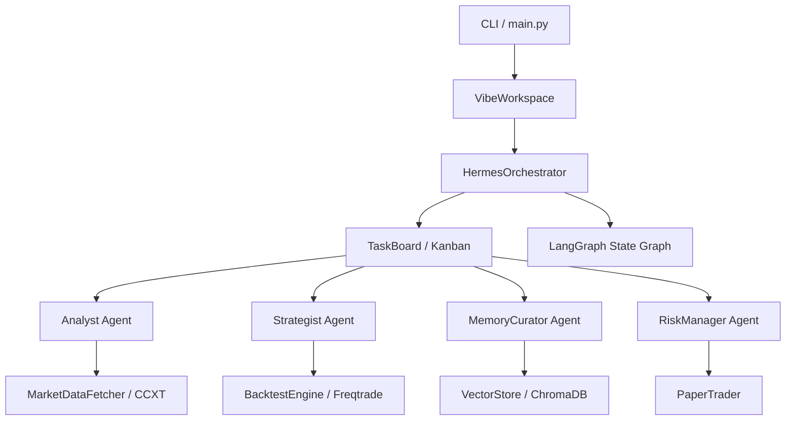

# crypto_agent_bot

Modular crypto trading bot with learning agents, inspired by Vibe-Trading and Hermes Agent patterns.

## Architecture



## Components

| Component | File | Role |
|---|---|---|
| **MarketDataFetcher** | `data/fetcher.py` | Live OHLCV + price via CCXT |
| **BacktestEngine** | `backtesting/engine.py` | Strategy backtesting via Freqtrade |
| **VectorStore** | `memory/vector_store.py` | Persistent RAG memory via ChromaDB |
| **AnalystAgent** | `agents/analyst.py` | Market analysis with real data tools |
| **StrategistAgent** | `agents/strategist.py` | Strategy generation + backtesting |
| **RiskManagerAgent** | `agents/risk_manager.py` | Risk metrics + go/no-go verdict |
| **MemoryCuratorAgent** | `agents/curator.py` | Cross-session memory retrieval |
| **HermesOrchestrator** | `orchestration/hermes.py` | Multi-agent Kanban workflow |
| **LangGraph Graph** | `orchestration/graph.py` | State-machine orchestration loop |
| **VibeWorkspace** | `workspace/vibe.py` | Rich CLI research workspace |
| **PaperTrader** | `execution/paper_trader.py` | Dry-run live simulation |

## Setup

```bash
# 1. Create virtual environment
python -m venv venv

# 2. Activate it
source venv/Scripts/activate   # Git Bash
venv\Scripts\activate          # Windows CMD

# 3. Install dependencies
pip install -r requirements.txt

# 4. Configure
cp .env.example .env
# Edit .env with your LLM API key and provider

# 5. Scaffold Freqtrade user data
python backtesting/setup_ft.py

# 6. Download historical data (once)
freqtrade download-data \
  --userdir ./ft_userdata \
  --exchange binance \
  -p BTC/USDT \
  --timerange 20260427- \
  --timeframes 1h
```

## Usage

```bash
# Interactive workspace
python main.py run

# One-shot research goal
python main.py new-goal "Find optimal SMA crossover for BTC/USDT"

# List goals
python main.py list-goals

# Review specific goal
python main.py review goal_20260527_123456

# Full demo pipeline
python main.py --demo
```

## Running Tests

```bash
python test_phase1.py   # Data fetcher
python test_phase2.py   # Backtesting engine
python test_phase3.py   # Agent layer (needs LLM API key)
python test_phase4.py   # Multi-agent orchestration
python test_phase5.py   # Research workspace
python test_phase6.py   # Memory / RAG
python test_phase7.py   # Risk management + paper trading
python test_e2e.py      # Full end-to-end
```

## Configuration (.env)

| Variable | Default | Description |
|---|---|---|
| `OPENAI_API_KEY` | — | LLM API key |
| `OPENAI_BASE_URL` | `https://api.openai.com/v1` | API base URL |
| `LLM_MODEL` | `gpt-4o-mini` | Model name |
| `EXCHANGE_ID` | `binance` | CCXT exchange |
| `SYMBOL` | `BTC/USDT` | Trading pair |
| `TIMEFRAME` | `1h` | Candle interval |
| `CHROMA_DB_PATH` | `./chroma_db` | Vector store directory |

## How It Works

1. **Define a research goal** via the workspace CLI
2. **TaskBoard** creates TODO items (analysis, strategy, risk)
3. **LangGraph** dispatches each task to the appropriate agent
4. **Analyst** fetches live market data and produces analysis
5. **Strategist** generates SMA crossover strategies, backtests via Freqtrade, and iterates
6. **MemoryCurator** retrieves past insights from ChromaDB for context
7. **RiskManager** evaluates the final strategy and issues go/no-go
8. Results stored in `workspace_registry.json` and `chroma_db/`
9. Approved strategies can be exported and deployed to the **PaperTrader**