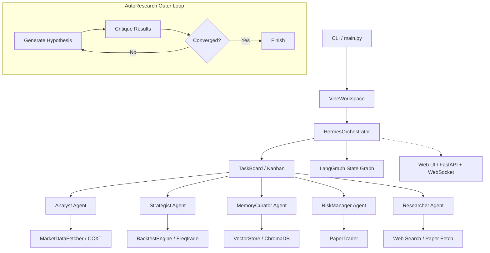

# crypto_agent_bot

Modular crypto trading bot with learning agents, inspired by Vibe-Trading and Hermes Agent patterns.

**Latest updates (May 2026):**
- Timerange sanitizer — converts any LLM date format (`2024-01-01/2024-12-31`) to freqtrade's `YYYYMMDD-YYYYMMDD`
- Strategy syntax validation — `ast.parse()` catches bad Python before handing to Freqtrade
- Web UI goal input fix — modal now sends your typed goal instead of the default
- TA-Lib compat fix — BBANDS uses `float` params, MACD casts to `float` before subtraction
- Data pre-loaded for BTC, ETH, XRP, SOL (5m/15m/1h, 2017–2026)

## Architecture



## Components

| Component | File | Role |
|---|---|---|
| **MarketDataFetcher** | `data/fetcher.py` | Live OHLCV + price via CCXT |
| **BacktestEngine** | `backtesting/engine.py` | Strategy backtesting via Freqtrade |
| **VectorStore** | `memory/vector_store.py` | Persistent RAG memory via ChromaDB |
| **AnalystAgent** | `agents/analyst.py` | Market analysis with real data tools |
| **StrategistAgent** | `agents/strategist.py` | Strategy gen + backtesting + 6 strategy types |
| **ResearcherAgent** | `agents/researcher.py` | Web search, paper reading, custom strategy specs |
| **RiskManagerAgent** | `agents/risk_manager.py` | Risk metrics + go/no-go verdict |
| **MemoryCuratorAgent** | `agents/curator.py` | Cross-session memory retrieval |
| **HermesOrchestrator** | `orchestration/hermes.py` | Multi-agent Kanban + outer research loop |
| **LangGraph Graph** | `orchestration/graph.py` | State-machine orchestration loop |
| **ResearchIteration** | `orchestration/research.py` | AutoResearch hypothesis/critique dataclass |
| **VibeWorkspace** | `workspace/vibe.py` | Rich CLI research workspace |
| **PaperTrader** | `execution/paper_trader.py` | Dry-run live simulation |
| **FastAPI Server** | `api/server.py` | WebSocket streaming + REST endpoints |
| **EventBus** | `api/event_bus.py` | Async event streaming for Web UI |
| **Web UI** | `ui/index.html` | Single-file React dashboard |

## Setup

```bash
# 1. Create virtual environment
python -m venv venv

# 2. Activate it
source venv/Scripts/activate   # Git Bash
venv\Scripts\activate          # Windows CMD

# 3. Install dependencies
pip install -r requirements.txt

# 4. Configure
cp .env.example .env
# Edit .env with your LLM API key and provider

# 5. Scaffold Freqtrade user data
python backtesting/setup_ft.py

# 6. Download historical data (once — covers BTC, ETH, XRP, SOL 5m/15m/1h)
freqtrade download-data \
  --userdir ./ft_userdata \
  --exchange binance \
  -p BTC/USDT ETH/USDT XRP/USDT SOL/USDT \
  --timerange 20170817- \
  --timeframes 5m 15m 1h
```

## Usage

```bash
# Web UI dashboard (with demo pipeline)
python main.py --demo

# Web UI only (no auto-demo — start goals from the modal)
python main.py --ui

# Interactive workspace
python main.py run

# One-shot research goal (with AutoResearch loop)
python main.py new-goal "Find optimal SMA crossover for BTC/USDT"

# With outer loop (iterations)
python main.py new-goal "Optimise MACD for ETH/USDT with max_iterations=5"
```

## Web UI

```bash
# Start the server + open browser + kick off demo goal
python main.py --demo

# Or start the server independently
python -m uvicorn api.server:app --host 127.0.0.1 --port 8765
```

The dashboard features agent timeline, hypothesis display with iteration counter, live metric cards (Sharpe, WR, drawdown, trades), SVG line charts, auto-scrolling event log, and a Run New Goal modal.

## Running Tests

```bash
python test_phase1.py   # Data fetcher
python test_phase2.py   # Backtesting engine
python test_phase3.py   # Agent layer (needs LLM API key)
python test_phase4.py   # Multi-agent orchestration
python test_phase5.py   # Research workspace
python test_phase6.py   # Memory / RAG
python test_phase7.py   # Risk management + paper trading
python test_e2e.py      # Full end-to-end
```

## Configuration (.env)

| Variable | Default | Description |
|---|---|---|
| `OPENAI_API_KEY` | — | LLM API key |
| `OPENAI_BASE_URL` | `https://api.openai.com/v1` | API base URL |
| `LLM_MODEL` | `gpt-4o-mini` | Model name |
| `EXCHANGE_ID` | `binance` | CCXT exchange |
| `SYMBOL` | `BTC/USDT` | Trading pair |
| `TIMEFRAME` | `1h` | Candle interval |
| `CHROMA_DB_PATH` | `./chroma_db` | Vector store directory |

## How It Works

1. **Define a research goal** via the CLI or Web UI
2. **Researcher Agent** (optional) searches the web for novel strategy ideas
3. **TaskBoard** creates TODO items (analysis, strategy, risk)
4. **LangGraph** dispatches each task to the appropriate agent
5. **Analyst** fetches live market data and produces analysis
6. **Strategist** generates strategies (SMA, MACD, RSI, Bollinger Bands, combined, or custom), backtests via Freqtrade, and iterates with keep/discard tracking
7. **MemoryCurator** retrieves past insights from ChromaDB for context
8. **RiskManager** evaluates the final strategy and issues go/no-go
9. **AutoResearch outer loop** (optional): generates hypotheses, critiques results, and repeats until convergence (Sharpe >= 1.5, WR >= 45%, DD <= 10%)
10. Results stored in `workspace_registry.json` and `chroma_db/`
11. Approved strategies can be exported and deployed to the **PaperTrader**

## Strategy Types

The strategist supports 6 strategy types:

| Type | Description | Indicators |
|---|---|---|
| `sma_crossover` | SMA fast/slow crossover | `ta.SMA` |
| `macd_crossover` | MACD signal line crossover | `ta.MACD` |
| `rsi_oversold` | RSI oversold/overbought | `ta.RSI` |
| `bollinger_bands` | Bollinger Bands lower/upper touch | `ta.BBANDS` |
| `combined_sma_rsi` | SMA crossover + RSI filter | `ta.SMA`, `ta.RSI` |
| `custom` | User-defined TA code | Any `ta.*` expressions |

## Strategist Tools

11 tools available to the LLM: `generate_strategy`, `generate_sma_strategy` (alias), `set_backtest_config`, `run_backtest`, `download_data`, `compare_strategies`, `interpret_metrics`, `suggest_next_params`, `get_best_strategy`, `get_iteration_history`, `get_research_history`.